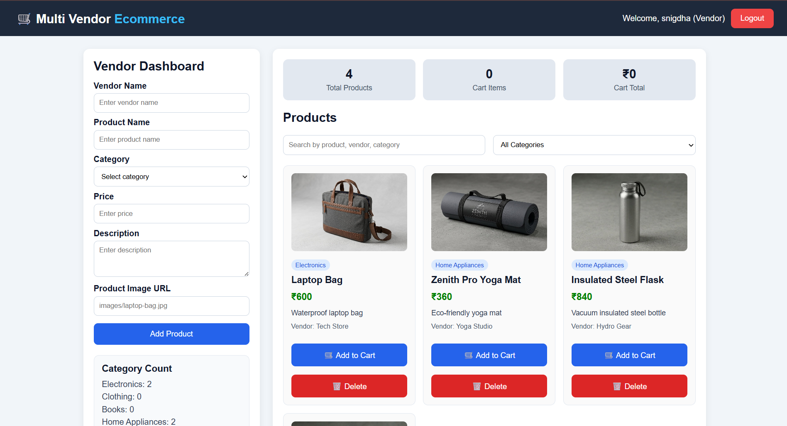

# 🛒 Multi Vendor Ecommerce Platform



> A fully functional multi-role ecommerce web app where Vendors can list products, Customers can shop and checkout, and Admins can manage the platform — built with pure HTML, CSS & JavaScript.

[](https://snigdhaxk.github.io/Ecommerce-platform/)
[]()
[]()
[]()

---

## 🔗 Live Demo

🌐 [https://snigdhaxk.github.io/Ecommerce-platform/](https://snigdhaxk.github.io/Ecommerce-platform/)

---

## 👥 User Roles

### 🧑‍💼 Vendor
- Access a dedicated **Vendor Dashboard**
- Add products with name, category, price, description & image
- View **Category Count** breakdown
- Delete own listed products
- See all products listed across the platform

### 🛍️ Customer
- Browse all available products
- **Search** by product name, vendor, or category
- **Filter** by category
- Add products to **Cart**
- Enter delivery address & select payment method
- **Proceed to Checkout**
- View **Latest Order** and **Order History**

### 🔐 Admin
- Role-based access control
- Manage the platform from an admin perspective

---

## ✨ Features

- 🔐 **Role-Based Login** — Choose between Vendor, Customer, or Admin on login
- 🛍️ **Product Listings** — Products shown with image, category badge, price & vendor name
- 🔍 **Search & Filter** — Search by product/vendor/category + filter by category dropdown
- 🛒 **Cart System** — Add to cart, view cart total & item count in real time
- 📦 **Checkout Flow** — Delivery address input + payment method selection
- 📋 **Order History** — Track latest order and previous orders
- 📊 **Vendor Dashboard** — Add/delete products with category analytics
- 📱 **Responsive Design** — Works across screen sizes

---

## 🛠️ Tech Stack

| Technology | Usage |
|---|---|
| HTML5 | Structure & semantic markup |
| CSS3 | Styling, layout, responsive design |
| JavaScript (Vanilla) | Role logic, cart, DOM manipulation, state management |
| GitHub Pages | Deployment & hosting |

---

## 📁 Project Structure

```
Ecommerce-platform/
├── images/            # Product images
├── index.html         # Main entry point
├── login.html         # Login page (role selection)
├── dashboard.html     # Role-based dashboard
├── dashboard.css      # Dashboard styles
├── app.js             # Core application logic
└── README.md          # Project documentation
```

---

## 🚀 How to Use

1. Visit the [live site](https://snigdhaxk.github.io/Ecommerce-platform/)
2. Enter any name and select a role:
   - **Vendor** → to add/manage products
   - **Customer** → to browse, cart & checkout
   - **Admin** → to manage the platform
3. Explore the features based on your role!

---

## 🧠 What I Learned

- Implementing **role-based access control** without a backend
- Managing **shared state** across multiple user views using vanilla JS
- Building a **cart system** with real-time total calculation
- Structuring a **multi-page frontend app** cleanly
- Handling **dynamic DOM rendering** for product listings
- Designing role-specific dashboards with a single codebase

---

## 👩‍💻 Author

**M. Snigdha Kundana**
3rd Year CSE Student

[](https://github.com/snigdhaxk)
[](https://www.linkedin.com/in/snigdha-kundana-molugu-b6b250302)

---

> ⭐ If you found this project interesting, consider giving it a star — it keeps me motivated to build more!
